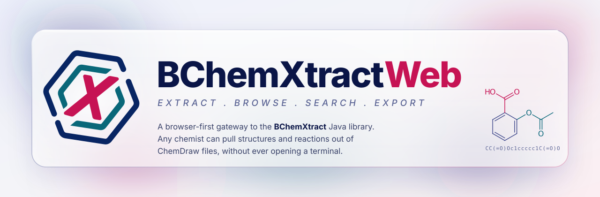
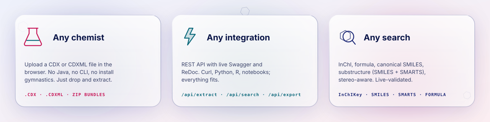
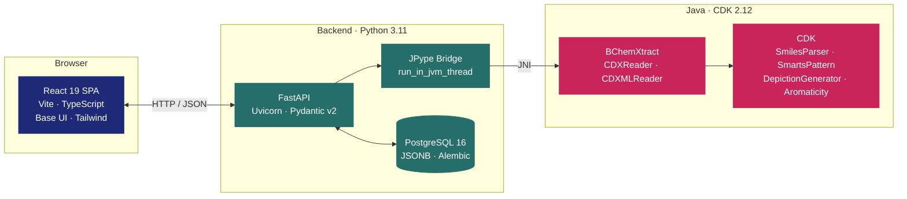
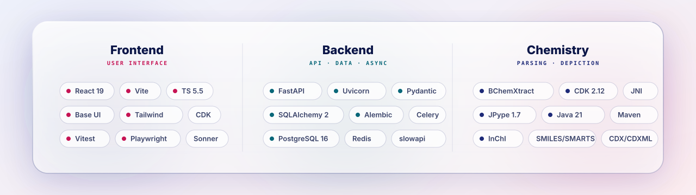

<div align="center">

<picture>
  <source media="(prefers-color-scheme: dark)" srcset="./assets/readme/hero-dark.svg">
  <source media="(prefers-color-scheme: light)" srcset="./assets/readme/hero-light.svg">
  
</picture>

<br>

<!-- tests/lint chips live on the `badges` branch, regenerated by CI with real
     status (scripts/generate_badges.py); the rest are committed under
     assets/readme/badges/ and regenerated with the same script. -->
<a href="https://github.com/Beilstein-Institut/BChemXtractWeb/actions/workflows/test.yml"><picture><source media="(prefers-color-scheme: dark)" srcset="https://github.com/Beilstein-Institut/BChemXtractWeb/raw/badges/tests-dark.svg"></picture></a>
<a href="https://github.com/Beilstein-Institut/BChemXtractWeb/actions/workflows/lint.yml"><picture><source media="(prefers-color-scheme: dark)" srcset="https://github.com/Beilstein-Institut/BChemXtractWeb/raw/badges/lint-dark.svg"></picture></a>
<a href="https://github.com/Beilstein-Institut/BChemXtractWeb"><picture><source media="(prefers-color-scheme: dark)" srcset="./assets/readme/badges/status-dark.svg"></picture></a>
<a href="./LICENSE"><picture><source media="(prefers-color-scheme: dark)" srcset="./assets/readme/badges/license-dark.svg"></picture></a>

<a href="https://www.python.org/"><picture><source media="(prefers-color-scheme: dark)" srcset="./assets/readme/badges/python-dark.svg"></picture></a>
<a href="https://fastapi.tiangolo.com/"><picture><source media="(prefers-color-scheme: dark)" srcset="./assets/readme/badges/fastapi-dark.svg"></picture></a>
<a href="https://react.dev/"><picture><source media="(prefers-color-scheme: dark)" srcset="./assets/readme/badges/react-dark.svg"></picture></a>
<a href="https://cdk.github.io/"><picture><source media="(prefers-color-scheme: dark)" srcset="./assets/readme/badges/cdk-dark.svg"></picture></a>
<a href="https://www.postgresql.org/"><picture><source media="(prefers-color-scheme: dark)" srcset="./assets/readme/badges/postgres-dark.svg"></picture></a>
<a href="https://www.docker.com/"><picture><source media="(prefers-color-scheme: dark)" srcset="./assets/readme/badges/docker-dark.svg"></picture></a>

<br>

**[🚀 Live Demo](#-status) · [📖 API Docs](#-api-at-a-glance) · [⚡ Quick Start](#-quick-start) · [🧬 Features](#-features) · [📝 Citation](#-citation)**

</div>

<picture>
  <source media="(prefers-color-scheme: dark)" srcset="./assets/readme/features-dark.svg">
  <source media="(prefers-color-scheme: light)" srcset="./assets/readme/features-light.svg">
  
</picture>

<picture>
  <source media="(prefers-color-scheme: dark)" srcset="./assets/readme/divider-dark.svg">
  <source media="(prefers-color-scheme: light)" srcset="./assets/readme/divider-light.svg">
  
</picture>

## 🧬 What it does

BChemXtractWeb wraps the upstream **[BChemXtract](https://github.com/Beilstein-Institut/BChemXtract)** Java library with what the CLI alone can't give you:

> **A browser UI**, **a REST API**, and **persistent searchable storage**, running side-by-side in a single `docker compose up`.

It parses ChemDraw's binary `.cdx` and XML `.cdxml` formats into JSON. Each extracted structure carries **InChI, InChIKey, canonical SMILES, extended SMILES, molecular formula, and MDL V3000**; each reaction carries **RInChI, RInChI key, reaction SMILES, and per-component atom mappings**. All of it is stored in PostgreSQL, so searches span every past upload, and matches come back highlighted in CDK-rendered SVG.

<picture>
  <source media="(prefers-color-scheme: dark)" srcset="./assets/readme/divider-dark.svg">
  <source media="(prefers-color-scheme: light)" srcset="./assets/readme/divider-light.svg">
  
</picture>

## ✨ Features

<table>
<tr>
<td valign="top" width="50%">

### 🧪 Structure extraction
- InChI · InChIKey · SMILES · Extended SMILES
- Molecular formula · MDL V3000
- Deduplication via `InChIKey` across the entire DB
- CDK 2.12 rendering with match highlighting

### 🔬 Reaction extraction *(experimental)*
- RInChI + long RInChI key
- Reaction SMILES
- Per-component InChI (reactants / products / agents)
- Stored separately from substances, so experimental failures never block the core path

### 💾 Persistent, queryable
- PostgreSQL 16 with JSONB for chemical metadata
- Every upload kept with its extraction history
- Per-extraction scope for "search within this file only"
- Alembic migrations, reversible, tested

</td>
<td valign="top" width="50%">

### 🔎 Search
- InChIKey lookup · molecular formula · canonical SMILES · substructure
- Substructure queries try **SMILES first**, then fall back to **SMARTS**
- Stereo-aware matching, opt-in toggle (default: ignore stereo)
- Live search that validates the query as you type and fetches only once it parses
- All-matches highlighting: every overlapping ring lights up

### 📤 Export everything
- PNG · JSON · SDF / MOL · CSV · Excel · CML · MDL V3000
- RXN / RDfile for extracted reactions
- Single-hit export, bulk by extraction, or filtered by search

### 🛡️ Production-grade
- Rate limiting per endpoint (default / upload / search / export)
- Structured error responses with stable `code` strings
- Single long-lived JVM per process, thread-safe JPype bridge
- OpenAPI 3.1 at `/docs` and `/redoc`
- 350+ backend tests (pytest), 690+ frontend tests (Vitest + Playwright), real DB + real JVM, no mocks

</td>
</tr>
</table>

<picture>
  <source media="(prefers-color-scheme: dark)" srcset="./assets/readme/divider-dark.svg">
  <source media="(prefers-color-scheme: light)" srcset="./assets/readme/divider-light.svg">
  
</picture>

## 🏗️ Architecture



**Three layers, one container stack.** The frontend talks HTTP/JSON to FastAPI. FastAPI keeps one JVM alive per process and dispatches every CDK call through a thread-attached executor, so async handlers stay responsive. PostgreSQL stores every extraction for later retrieval and cross-upload substructure search.

<picture>
  <source media="(prefers-color-scheme: dark)" srcset="./assets/readme/divider-dark.svg">
  <source media="(prefers-color-scheme: light)" srcset="./assets/readme/divider-light.svg">
  
</picture>

## ⚡ Quick Start

**The fastest path: one script does everything.**

```bash
git clone https://github.com/Beilstein-Institut/BChemXtractWeb.git
cd BChemXtractWeb
./deploy.sh
```

`deploy.sh` runs preflight checks, resolves the latest BChemXtract release tag from upstream (override with `BCHEMXTRACT_REF=vX.Y.Z` to pin), generates random secrets into `.env` (skipped if `.env` already exists), and brings the stack up via `docker compose`. The backend Docker image clones BChemXtract directly from upstream at image build time. No submodule, no host-side JAR build needed.

Open **<http://localhost:3000>**. The API is behind nginx at `/api`, the interactive docs at `/docs`. The default public port is **3000**, chosen to avoid the Apache/system-nginx collision on Ubuntu/Debian hosts. The first run prompts for the port; press Enter to accept it.

### Choosing a different host port

`deploy.sh` writes the chosen port to `.env` as `HTTP_PORT` and `docker-compose.yml` interpolates it into the nginx `ports:` mapping. Three ways to set it:

```bash
# 1. Interactive prompt (first run; later runs: add --change-port)
./deploy.sh
#   ==> Selecting public HTTP port
#   Port [3000]:

# 2. CLI flag (skips the prompt; works on fresh checkout or to update .env)
./deploy.sh --port 9000

# 3. Environment variable (equivalent to --port; --port wins if both are set)
HTTP_PORT=9000 ./deploy.sh
```

Validation:
- `1`–`65535` accepted
- `<1024` (privileged): warning, accepted (Docker may need root or `CAP_NET_BIND_SERVICE`)
- `5432`, `6379`, `8000`, `5173`: warning (collide with stack internals), accepted
- Anything else: re-prompt (interactive) or exit with an error (flag / env var)

The backend FastAPI is **bound to `127.0.0.1:8000` only**: curl and CLI scripts on the deploy host reach it at `http://127.0.0.1:8000`; other machines cannot. Like `db` and `redis` it is internal by design, so the only public surface is nginx on `HTTP_PORT`. Set `BACKEND_PORT=N` in `.env` to move the host port, or replace the `127.0.0.1` in `docker-compose.yml` with `0.0.0.0` if you really do want the raw API on the network.

### Serving from a sub-path (behind a corporate reverse proxy)

By default the app owns the origin root. To publish it below a prefix instead — e.g. `https://cheminfo.beilstein.org/bchemxtract` — set the prefix once and rebuild:

```bash
./deploy.sh --base-path /bchemxtract    # --base-path / resets to the root
```

Vite bakes the prefix into every asset, API, and route URL **at build time**, so changing it always requires the image rebuild that `deploy.sh` performs. A stale build is the classic symptom: the page serves, the boot splash paints, and then hangs forever because `/assets/index-*.js` resolved above the prefix, 404'd as HTML, and got rejected by `nosniff`.

The Apache side can forward the prefix as-is — `nginx/nginx.conf.template` strips it before its own `location` blocks match:

```apache
ProxyPass        "/bchemxtract" "http://localhost:3000/bchemxtract"
ProxyPassReverse "/bchemxtract" "http://localhost:3000/bchemxtract"
ProxyTimeout     1800   # batch progress (SSE) streams stay open up to 30 min
```

Two things to get right on the proxy host:

- **`ProxyTimeout`** must exceed the longest batch run, or Apache cuts the `/api/batch/{id}/progress` SSE stream mid-batch. Extraction itself needs ≥130 s.
- **Don't let `mod_deflate` buffer `text/event-stream`**, or progress events arrive in one lump at the end.

And in `.env`, set `CORS_ORIGINS` to the **public origin without the path** (`["https://cheminfo.beilstein.org"]`). That is also what flips the `bcx_sid` cookie to `Secure` — see **Production posture switch** below.

The prefix that nginx strips is hardcoded in `nginx/nginx.conf.template` (two `rewrite` lines); change it there too if you use anything other than `/bchemxtract`. Alternatively, have Apache strip the prefix itself (`ProxyPass "/bchemxtract/" "http://localhost:3000/"` plus `RedirectMatch ^/bchemxtract$ /bchemxtract/`) and delete those two rewrites, which keeps the prefix defined in exactly one place.

### Rotating secrets

Every `./deploy.sh` run probes the live database with the current `.env` credentials before bringing the stack up, and aborts with the matching rotation command if either the bootstrap superuser or the `bchemxtract_app` role rejects auth, so a hand-edited `.env` can't crash `migrate` silently. (The probe is a no-op on a fresh deploy.) Three rotation flags:

- `./deploy.sh --rotate-keys`: regenerate `ADMIN_SECRET` only; `SECRET_KEY` and `POSTGRES_PASSWORD` are deliberately left alone (see **Generating `.env` secrets** below).
- `./deploy.sh --rotate-app-db`: regenerate `APP_DB_PASSWORD` and `ALTER ROLE bchemxtract_app` in the running database. The script's closing `docker compose up -d` restarts the services that consume it.
- `./deploy.sh --rotate-postgres-password`: regenerate `POSTGRES_PASSWORD` and `ALTER ROLE` the bootstrap superuser. Recovery path when `migrate` exits with `password authentication failed for user "bchemxtract"`, i.e. `.env` drifted from what Postgres persisted in the `pgdata` volume (the env var is only honored on first init, so hand-editing it or restoring a backup desyncs the role).

<details>
<summary><b>🛠️ Manual setup (no script)</b></summary>

<br>

```bash
git clone https://github.com/Beilstein-Institut/BChemXtractWeb.git
cd BChemXtractWeb
cp .env.example .env          # then fill in secrets (see "Generating .env secrets" below)

# Build + start. backend/Dockerfile clones BChemXtract from upstream at build
# time; to pin a specific tag, export BCHEMXTRACT_VERSION=vX.Y.Z first.
docker compose up -d --build
```

</details>

<details>
<summary><b>🔑 Generating <code>.env</code> secrets</b></summary>

<br>

`.env` needs four random secrets (all 32+ characters). `deploy.sh` mints them on first run; to generate one manually:

```bash
python -c "import secrets; print(secrets.token_urlsafe(32))"
```

- **`POSTGRES_PASSWORD`**: bootstrap Postgres superuser password. The `migrate` service connects as this user to run DDL (alembic upgrades, RLS policies, `CREATE ROLE`).
- **`APP_DB_PASSWORD`**: password for the runtime `bchemxtract_app` Postgres role (`NOSUPERUSER NOBYPASSRLS`). Backend, celery-worker, and celery-beat all connect as this role so Postgres RLS policies actually enforce session ownership on every query. Without this, the backend silently bypasses RLS via the superuser path and every cookie session can read every other session.
- **`SECRET_KEY`**: PBKDF2 salt for API-key lookup hashes and HMAC key for CSRF tokens. **Do not** rotate without coordinating a full API-key re-issue; rotating it invalidates every stored key hash and every outstanding CSRF token. `deploy.sh --rotate-keys` deliberately leaves it alone.
- **`ADMIN_SECRET`**: gate for `POST/GET/DELETE /api/admin/api-keys`. Constant-time compared against the `X-Admin-Secret` request header. Safe to rotate via `./deploy.sh --rotate-keys`.

**Production posture switch.** `DEBUG`, `CORS_ORIGINS` and `BASE_PATH` have to agree, so `deploy.sh` derives all three from one answer — the URL users will open — instead of asking you to hand-edit `.env`. An interactive run prompts:

```
==> Deployment posture

  1) localhost — plain HTTP on this machine only
       DEBUG=true, CORS_ORIGINS=["http://localhost:3000"]
       /docs + /openapi.json exposed, session cookie NOT Secure

  2) production — reachable from a network, TLS terminated upstream
       DEBUG=false, CORS_ORIGINS + BASE_PATH derived from your URL
       /docs + /openapi.json disabled, session cookie Secure
```

Picking **2** asks for the public URL and writes the rest. Non-interactively:

```bash
./deploy.sh --public-url https://cheminfo.beilstein.org/bchemxtract   # production
./deploy.sh --localhost                                              # back to dev
```

From `https://cheminfo.beilstein.org/bchemxtract` it writes `DEBUG=false`, `CORS_ORIGINS=["https://cheminfo.beilstein.org"]` (origin only — CORS never takes a path) and `BASE_PATH=/bchemxtract`. An explicit `--base-path` still wins over the URL's path.

You still have to **terminate TLS upstream yourself** — the bundled nginx serves plain HTTP. Everything else is enforced for you:

- `https://` is required. Over plain HTTP the browser discards the `Secure` `bcx_sid` cookie, so every request would arrive session-less — `--public-url http://…` is rejected rather than left to fail confusingly at runtime.
- A `localhost` URL is rejected too: that's posture 1.
- `DEBUG=false` requires ≥32-char `SECRET_KEY` / `ADMIN_SECRET`. `deploy.sh` mints those itself, but a hand-shortened value aborts the deploy with the `--rotate-keys` fix instead of crash-looping the backend.
- A re-deploy with no flags and no TTY never silently downgrades a production posture; a hand-edited `DEBUG=false` + localhost CORS combination (which the backend's `_validate_prod_cors` guard rejects on import) aborts before `compose up`.

</details>

<details>
<summary><b>🧑‍💻 Running the dev stack without Docker</b></summary>

<br>

Useful if you're iterating on the backend or frontend directly.

```bash
# Backend: Python 3.11 + Java 21 JDK + Maven 3.8+ required
cd backend
python -m venv .venv && source .venv/bin/activate
pip install -e ".[dev]"
bash scripts/build_jar.sh                 # builds backend/jars/*.jar
uvicorn app.main:app --reload --port 8000

# Frontend: Node 18+
cd ../frontend
npm install
npm run dev                                # http://localhost:5173
```

You'll also need a local PostgreSQL 16 on `:5432`, either via `docker compose up -d db` or a standalone Postgres with `bchemxtract_test` and `bchemxtract` databases.

</details>

<details>
<summary><b>🧪 Running the test suites</b></summary>

<br>

```bash
# Backend (real DB, real JVM, no mocks)
cd backend && pytest                                      # full suite
cd backend && pytest tests/test_substructure_algorithm.py # a single file

# Frontend
cd frontend && npx vitest run                             # full suite (Vitest)
cd frontend && npx vitest run src/hooks/useSearchImpl.test.ts

# deploy.sh (not in CI — needs docker/git stubs, takes a few minutes)
bash tests/test_deploy_port.sh          # ports, base path, posture (.env writes)
python3 tests/test_deploy_prompts.py    # the interactive prompts, via a pty

# CI-equivalent green check before pushing
cd backend && ruff check . && ruff format --check .
cd frontend && npm run lint && npx tsc --noEmit && \
  npx prettier --check "src/**/*.{ts,tsx,css}" "e2e/**/*.ts" index.html
```

</details>

<picture>
  <source media="(prefers-color-scheme: dark)" srcset="./assets/readme/divider-dark.svg">
  <source media="(prefers-color-scheme: light)" srcset="./assets/readme/divider-light.svg">
  
</picture>

## 🔌 API at a glance

Every endpoint is documented at `/docs` (Swagger) and `/redoc` once the stack is running. A tour of the important ones:

| Method | Path | What it does |
| :--- | :--- | :--- |
| `POST` | `/api/extract` | Upload CDX/CDXML, full structure extraction with descriptors |
| `POST` | `/api/reactions` | Same upload, but for reactions (experimental) |
| `POST` | `/api/search` | Search by `inchi_key`, `formula`, `smiles`, or `substructure` |
| `POST` | `/api/search/validate` | Parse-only SMILES/SMARTS gate for live-typing UX |
| `POST` | `/api/export` | Substances in any of 7 formats (PNG, JSON, SDF, CSV, XLSX, CML, V3000) |
| `POST` | `/api/export` *(fmt=rxn)* | Reactions in RXN / RDfile |
| `GET` | `/api/history` | Your upload timeline |
| `GET` | `/api/extractions/{id}` | Full detail for one extraction |
| `POST` | `/api/admin/api-keys` | Mint a new `bcx_...` key (X-Admin-Secret gated) |

<details>
<summary><b>🔑 Minting a programmatic API key</b></summary>

<br>

The browser SPA needs no key — it authenticates via a `bcx_sid` UUID4 cookie (HttpOnly, SameSite=Lax, Secure in production) plus a session-bound CSRF token on every mutating request. CLI / programmatic callers mint their own `X-API-Key` once, then pass it on every request; `Authorization: Bearer` is not accepted:

```bash
# Issue an admin-minted API key (requires the ADMIN_SECRET from .env)
curl -X POST http://localhost:3000/api/admin/api-keys \
  -H "X-Admin-Secret: $ADMIN_SECRET" \
  -H "Content-Type: application/json" \
  -d '{"name":"cli-scripting","expiry_days":90}'
# {"id": 1, "key": "bcx_<48-chars>", "expires_at": "2026-08-..."}
#
# Save the `key` field; it is shown exactly once. Subsequent GETs return
# only the lookup hash, never the plaintext.
export MY_KEY="bcx_<48-chars-from-the-response>"
```

Keys can be listed (`GET /api/admin/api-keys`) and revoked (`DELETE /api/admin/api-keys/{id}`); both require the same `X-Admin-Secret`. Admin endpoints are rate-limited to 5/minute per IP.

</details>

<details>
<summary><b>📬 Show me a real request</b></summary>

<br>

```bash
# Extract a CDX file (programmatic, using the X-API-Key minted above)
curl -X POST http://localhost:3000/api/extract \
  -H "X-API-Key: $MY_KEY" \
  -F "file=@paper-figure-7.cdx"

# Substructure search: all overlapping benzene rings in naphthalene, all highlighted
curl -X POST http://localhost:3000/api/search \
  -H "X-API-Key: $MY_KEY" \
  -H "Content-Type: application/json" \
  -d '{"query":"c1ccccc1","type":"substructure","page":1,"size":24}'

# Live parse-validate (powers the client-side debounce gate)
curl -X POST http://localhost:3000/api/search/validate \
  -H "Content-Type: application/json" \
  -d '{"query":"[CX3]=O","stereo":false}'
# {"valid":true,"language":"smarts","atom_count":2,"error":null}
```

</details>

<picture>
  <source media="(prefers-color-scheme: dark)" srcset="./assets/readme/divider-dark.svg">
  <source media="(prefers-color-scheme: light)" srcset="./assets/readme/divider-light.svg">
  
</picture>

## 🧱 Tech stack

<picture>
  <source media="(prefers-color-scheme: dark)" srcset="./assets/readme/stack-dark.svg">
  <source media="(prefers-color-scheme: light)" srcset="./assets/readme/stack-light.svg">
  
</picture>

<picture>
  <source media="(prefers-color-scheme: dark)" srcset="./assets/readme/divider-dark.svg">
  <source media="(prefers-color-scheme: light)" srcset="./assets/readme/divider-light.svg">
  
</picture>

## 📊 Status

| Milestone **v1.0** | Progress |
| :--- | :---: |
| Upload & extract CDX/CDXML | ✅ |
| 2D viewer with match highlights | ✅ |
| Structure search (InChIKey · formula · SMILES · substructure) | ✅ |
| Reaction extraction (experimental) | ✅ |
| Export: PNG · JSON · SDF · CSV · XLSX · CML · V3000 · RXN · RDfile | ✅ |
| Persistent storage in PostgreSQL | ✅ |
| REST API with Swagger / ReDoc | ✅ |
| Docker Compose deployment | ✅ |
| Bulk file processing with progress tracking | ✅ |
| Hosted public demo | 🔜 *Coming soon* |

<sub>Issues and pull requests welcome. A contributor guide will follow.</sub>

<picture>
  <source media="(prefers-color-scheme: dark)" srcset="./assets/readme/divider-dark.svg">
  <source media="(prefers-color-scheme: light)" srcset="./assets/readme/divider-light.svg">
  
</picture>

## 📝 Citation

If BChemXtractWeb helps your research, please cite us. The **`CITATION.cff`** in this repo will be picked up automatically by GitHub's "Cite this repository" button and by Zenodo / Zotero.

```bibtex
@software{bchemxtractweb,
  author  = {Rajan, Kohulan and Bänsch, Felix},
  title   = {{BChemXtractWeb: A web application for extracting
             chemical structures and reactions from ChemDraw files}},
  year    = {2026},
  url     = {https://github.com/Beilstein-Institut/BChemXtractWeb},
  license = {MIT}
}
```

Please also cite the upstream Java library: **[BChemXtract](https://github.com/Beilstein-Institut/BChemXtract)**.

<picture>
  <source media="(prefers-color-scheme: dark)" srcset="./assets/readme/divider-dark.svg">
  <source media="(prefers-color-scheme: light)" srcset="./assets/readme/divider-light.svg">
  
</picture>

## 🤝 Acknowledgments

<table>
<tr>
<td align="center" width="50%">

**Developed at the**<br>
**[Beilstein-Institut zur Förderung der Chemischen Wissenschaften](https://www.beilstein-institut.de/en/)**

</td>
<td align="center" width="50%">

**Built on**<br>
**[BChemXtract](https://github.com/Beilstein-Institut/BChemXtract)**, the underlying Java parser<br>
**[CDK](https://cdk.github.io/)**, the Chemistry Development Kit

</td>
</tr>
</table>

<picture>
  <source media="(prefers-color-scheme: dark)" srcset="./assets/readme/divider-dark.svg">
  <source media="(prefers-color-scheme: light)" srcset="./assets/readme/divider-light.svg">
  
</picture>

## 📜 License

Released under the **[MIT License](./LICENSE)**. © 2026 Beilstein-Institut zur Förderung der Chemischen Wissenschaften.

<br>

<div align="center">


<sub><i>Chemical structures out of ChemDraw files, in the browser.</i></sub>

</div>
