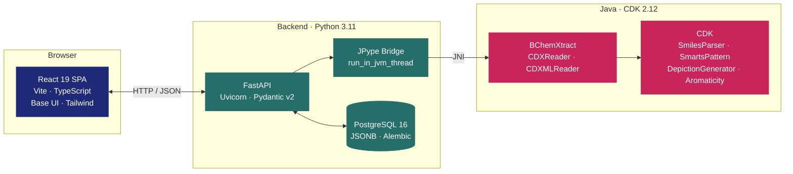

<div align="center">


# BChemXtractWeb

### *Extract. Browse. Search. Export.*

**A browser-first gateway to the [BChemXtract](https://github.com/Beilstein-Institut/BChemXtract) Java library — so any chemist can pull structures and reactions out of ChemDraw files without ever opening a terminal.**

<br>

[](https://github.com/Beilstein-Institut/BChemXtractWeb/actions/workflows/test.yml)
[](https://github.com/Beilstein-Institut/BChemXtractWeb/actions/workflows/lint.yml)
[](https://github.com/Beilstein-Institut/BChemXtractWeb/releases)
[](./LICENSE)

[](https://www.python.org/)
[](https://fastapi.tiangolo.com/)
[](https://react.dev/)
[](https://cdk.github.io/)
[](https://www.postgresql.org/)
[](https://www.docker.com/)

<br>

**[🚀 Live Demo](#-status) · [📖 API Docs](#-api-at-a-glance) · [⚡ Quick Start](#-quick-start) · [🧬 Features](#-features) · [📝 Citation](#-citation)**

</div>

---

<table align="center">
<tr>
<td width="33%" align="center">
<h3>🧪 Any chemist</h3>
<sub>Upload a CDX or CDXML file in the browser.<br>No Java, no CLI, no install gymnastics.</sub>
</td>
<td width="33%" align="center">
<h3>⚡ Any integration</h3>
<sub>REST API with live Swagger / ReDoc.<br>Curl, Python, R, notebooks — everything fits.</sub>
</td>
<td width="33%" align="center">
<h3>🔎 Any search</h3>
<sub>InChI, formula, canonical SMILES,<br>substructure (SMILES + SMARTS, stereo-aware).</sub>
</td>
</tr>
</table>

---

## 🧬 What it does

BChemXtractWeb wraps the upstream **[BChemXtract](https://github.com/Beilstein-Institut/BChemXtract)** Java library in a production-ready stack so you get three things the CLI alone can't give you:

> **A browser UI**, **a REST API**, and **persistent searchable storage** — running side-by-side in a single `docker compose up`.

Parse ChemDraw's binary `.cdx` and XML `.cdxml` formats into rich JSON. Every extracted structure carries its full descriptor bundle — **InChI, InChIKey, canonical SMILES, extended SMILES, molecular formula, MDL V3000**. Every extracted reaction carries **RInChI, RInChI key, reaction SMILES, and per-component atom mappings**. Everything is searchable across every upload you've ever made, with substructure highlights rendered client-side in crisp CDK SVG.

---

## ✨ Features

<table>
<tr>
<td valign="top" width="50%">

### 🧪 Structure extraction
- Full descriptor bundle per hit
- InChI · InChIKey · SMILES · Extended SMILES
- Molecular formula · MDL V3000
- Deduplication via `InChIKey` across the entire DB
- CDK 2.12 rendering, Apple-Blue match highlights

### 🔬 Reaction extraction *(experimental)*
- RInChI + long RInChI key
- Reaction SMILES
- Per-component InChI (reactants / products / agents)
- Stored separately from substances so experimental failures never block the core path

### 💾 Persistent, queryable
- PostgreSQL 16 with JSONB for chemical metadata
- Every upload kept with its extraction history
- Per-extraction scope for "search within this file only"
- Alembic migrations, reversible, tested

</td>
<td valign="top" width="50%">

### 🔎 Multi-modal search
- InChIKey lookup · molecular formula · canonical SMILES · substructure
- Dual-parser substructure: tries **SMILES first**, falls back to **SMARTS**
- Stereo-aware matching, opt-in toggle (default: ignore stereo)
- Hybrid live-search: parse-validate, then debounce-fetch
- All-matches highlighting (not `uniqueAtoms` — every overlapping ring lights up)

### 📤 Export everything
- PNG · JSON · SDF / MOL · CSV · Excel · CML · MDL V3000
- RXN / RDfile for extracted reactions
- Single-hit export, bulk by extraction, or filtered by search

### 🛡️ Production-grade
- Rate limiting per endpoint (default / upload / search / export)
- Structured error responses with stable `code` strings
- Single long-lived JVM per process, thread-safe JPype bridge
- OpenAPI 3.1 at `/docs` and `/redoc`
- 350+ backend tests · 690+ frontend tests · real-DB integration, not mocks

</td>
</tr>
</table>

---

## 🏗️ Architecture



**Three layers, one container stack.** The frontend talks HTTP/JSON to FastAPI. FastAPI keeps one JVM alive per process and dispatches every CDK call through a thread-attached executor so async handlers stay responsive. PostgreSQL stores every extraction for later retrieval — and makes global substructure search trivial.

---

## ⚡ Quick Start

The fastest path: **Docker Compose does everything.**

```bash
git clone --recurse-submodules https://github.com/Beilstein-Institut/BChemXtractWeb.git
cd BChemXtractWeb
cp .env.example .env          # set POSTGRES_PASSWORD + API_KEYS

# First-time only — builds the upstream BChemXtract fat JAR
cd backend && bash scripts/build_jar.sh && cd ..

# Fire it up
docker compose up -d --build
```

Open **<http://localhost>**. The API is behind nginx at `/api`, the interactive docs at `/docs`.

<details>
<summary><b>🧑‍💻 Running the dev stack without Docker</b></summary>

<br>

Useful if you're iterating on the backend or frontend directly:

```bash
# Backend — Python 3.11 + Java 17 JDK required
cd backend
python -m venv .venv && source .venv/bin/activate
pip install -e ".[dev]"
bash scripts/build_jar.sh                 # builds backend/jars/*.jar
uvicorn app.main:app --reload --port 8000

# Frontend — Node 18+
cd ../frontend
npm install
npm run dev                                # → http://localhost:5173
```

You'll also need a local PostgreSQL 16 on `:5432` — either via `docker compose up -d db` or a standalone Postgres with `bchemxtract_test` and `bchemxtract` databases.

</details>

<details>
<summary><b>🧪 Running the test suites</b></summary>

<br>

```bash
# Backend — real DB, real JVM, no mocks
cd backend && pytest                                      # 350+ tests
cd backend && pytest tests/test_substructure_algorithm.py # a single file

# Frontend
cd frontend && npm run test                               # 690+ tests, Vitest
cd frontend && npx vitest run src/hooks/useSearchImpl.test.ts

# CI-equivalent green check before pushing
cd backend && ruff check . && ruff format --check .
cd frontend && npm run lint && npx tsc --noEmit && \
  npx prettier --check "src/**/*.{ts,tsx,css}" "e2e/**/*.ts" index.html
```

</details>

---

## 🔌 API at a glance

Every endpoint is documented at `/docs` (Swagger) and `/redoc` once the stack is running. A tour of the important ones:

| Method | Path | What it does |
| :--- | :--- | :--- |
| `POST` | `/api/extract` | Upload CDX/CDXML → full structure extraction with descriptors |
| `POST` | `/api/reactions` | Same upload, but for reactions (experimental) |
| `POST` | `/api/search` | Multi-modal search: `inchi_key`, `formula`, `smiles`, `substructure` |
| `POST` | `/api/search/validate` | Parse-only SMILES/SMARTS gate for live-typing UX |
| `POST` | `/api/export` | Substances in any of 7 formats (PNG, JSON, SDF, CSV, XLSX, CML, V3000) |
| `POST` | `/api/export` *(fmt=rxn)* | Reactions in RXN / RDfile |
| `GET` | `/api/history` | Your upload timeline |
| `GET` | `/api/extractions/{id}` | Full detail for one extraction |

<details>
<summary><b>📬 Show me a real request</b></summary>

<br>

```bash
# Extract a CDX file
curl -X POST http://localhost/api/extract \
  -H "X-API-Key: $MY_KEY" \
  -F "file=@paper-figure-7.cdx"

# Substructure search — all overlapping benzene rings in naphthalene, all highlighted
curl -X POST http://localhost/api/search \
  -H "X-API-Key: $MY_KEY" \
  -H "Content-Type: application/json" \
  -d '{"query":"c1ccccc1","type":"substructure","page":1,"size":24}'

# Live parse-validate (powers the client-side debounce gate)
curl -X POST http://localhost/api/search/validate \
  -H "Content-Type: application/json" \
  -d '{"query":"[CX3]=O","stereo":false}'
# → {"valid":true,"language":"smarts","atom_count":2,"error":null}
```

</details>

---

## 🧱 Tech stack

<table>
<tr>
<td valign="top" width="33%" align="center">

### Frontend
**[React 19](https://react.dev/)** · Vite · TypeScript<br>
**[Base UI](https://base-ui.com/)** · Tailwind CSS<br>
Vitest · Playwright<br>
Sonner toasts

</td>
<td valign="top" width="33%" align="center">

### Backend
**[FastAPI](https://fastapi.tiangolo.com/)** · Uvicorn<br>
Pydantic v2 · SQLAlchemy 2 async<br>
Alembic · slowapi (rate limits)<br>
pytest · pytest-asyncio

</td>
<td valign="top" width="33%" align="center">

### Chemistry
**[BChemXtract](https://github.com/Beilstein-Institut/BChemXtract)** (fat JAR)<br>
**[CDK 2.12](https://cdk.github.io/)** — parsing + depiction<br>
[JPype 1.7](https://github.com/jpype-project/jpype) bridge<br>
Java 17 JDK

</td>
</tr>
</table>

---

## 📊 Status

| Milestone **v1.0** | Progress |
| :--- | :---: |
| Upload & extract CDX/CDXML | ✅ |
| 2D viewer with match highlights | ✅ |
| Structure search (InChIKey · formula · SMILES · substructure) | ✅ |
| Reaction extraction (experimental) | ✅ |
| Export: PNG · JSON · SDF · CSV · XLSX · CML · V3000 · RXN · RDfile | ✅ |
| Persistent storage in PostgreSQL | ✅ |
| REST API with Swagger / ReDoc | ✅ |
| Docker Compose deployment | ✅ |
| **Bulk file processing with progress tracking** | 🚧 |
| Hosted public demo | 🔜 *Coming soon* |

<sub>Issues and pull requests welcome. A contributor guide will follow.</sub>

---

## 📝 Citation

If BChemXtractWeb helps your research, please cite us — the **`CITATION.cff`** in this repo will be picked up automatically by GitHub's "Cite this repository" button and by Zenodo / Zotero.

```bibtex
@software{bchemxtractweb,
  author  = {Rajan, Kohulan and Bänsch, Felix},
  title   = {{BChemXtractWeb: A web application for extracting
             chemical structures and reactions from ChemDraw files}},
  year    = {2026},
  url     = {https://github.com/Beilstein-Institut/BChemXtractWeb},
  license = {MIT}
}
```

Please also cite the upstream Java library: **[BChemXtract](https://github.com/Beilstein-Institut/BChemXtract)**.

---

## 🤝 Acknowledgments

<table>
<tr>
<td align="center" width="50%">

**Developed at the**<br>
**[Beilstein-Institut zur Förderung der Chemischen Wissenschaften](https://www.beilstein-institut.de/en/)**

</td>
<td align="center" width="50%">

**Built on**<br>
**[BChemXtract](https://github.com/Beilstein-Institut/BChemXtract)** — the underlying Java parser<br>
**[CDK](https://cdk.github.io/)** — the Chemistry Development Kit

</td>
</tr>
</table>

---

## 📜 License

Released under the **[MIT License](./LICENSE)** — © 2026 Beilstein-Institut zur Förderung der Chemischen Wissenschaften.

<br>

<div align="center">


<sub><i>Parse the drawings. Keep the chemistry.</i></sub>

</div>
